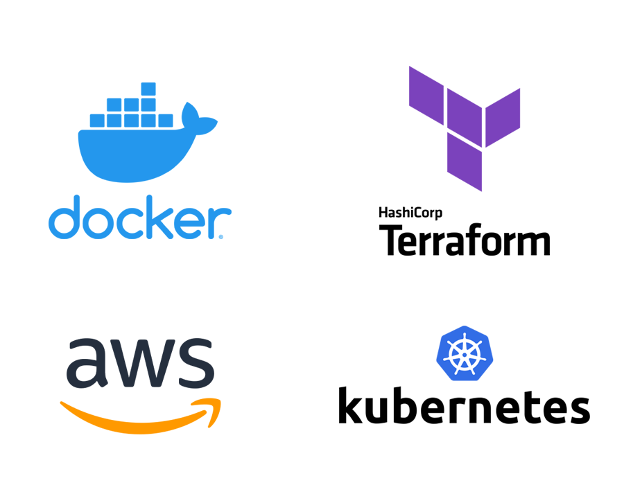

# To-Do List Application (Containerized, deployed with Terraform and EKS)

This project is a simple To-Do List application, containerized and deployed on AWS EKS with Terraform. It demonstrates a full-stack setup using a React frontend, Node.js/Express backend, and PostgreSQL database, all managed in an AWS EKS (Elastic Kubernetes Service) cluster. The frontend and backend images are available on Docker Hub, making it easy for others to clone and deploy this application with minimal configuration.


## Features
- **Create To-Dos:** Add new items to your list.
- **Delete To-Dos:** Remove items when completed.
- **Data Persistence:** All items are stored in a PostgreSQL database.
- **Fully Containerized:** Frontend, backend, and database are containerized and deployed on AWS EKS using Terraform.

## Technologies Used
- **Frontend:** React
- **Backend:** Node.js, Express
- **Database:** PostgreSQL
- **Containerization:** Docker
- **Infrastructure as Code (IaC):** Terraform for EKS setup
- **Hosting Platform:** AWS EKS (Elastic Kubernetes Service)

## Architecture
This project has a simple three-tier architecture:

- **Frontend (React):** Manages the user interface and interacts with the backend.
- **Backend (Node.js/Express):** Handles API requests, processes data, and communicates with the database.
- **Database (PostgreSQL):** Stores the To-Do items, ensuring data persistence.

### Deployment Diagram
- **Frontend:** Deployed on a public subnet with a LoadBalancer.
- **Backend:** Deployed on a private subnet, accessed by the frontend via ClusterIP.
- **Database:** Deployed using AWS RDS, accessed by the backend in the same VPC for security.

## Setup and Installation

### Prerequisites
- **AWS Account:** Required for deploying EKS, RDS, and other resources.
- **AWS CLI** Make sure the AWS Command Line Interface is installed.
- **Terraform:** Ensure Terraform is installed (version 0.13+).
- **kubectl:** Ensure Kubernetes command-line is installed.

### Steps to Deploy

1. **Clone the repository:**
   ```bash
   git clone https://github.com/mrgitics/todo-app-eks-terraform.git
   cd todo-app-terraform-eks

2. **Configure AWS credentials:**

    Ensure that your AWS CLI is configured.
    Run the following command to enter your AWS Access Key, Secret Key, region, and output format:
    ```bash
      aws configure
      ```

3. **Modify Terraform variables:**

    Adjust variables in terraform.tfvars as needed. This file contains settings for:
    AWS Region
    Cluster name
    Instance type for EKS nodes
    Database credentials (Note: these are stored in plain text for demonstration purposes)

4. **Deploy with Terraform:**

    ```bash    
    terraform init
    terraform plan
    terraform apply
    ```
    Terraform will set up the VPC, subnets, EKS cluster, RDS instance, and deploy the application to EKS.
    
    **Troubleshooting**  
    If you encounter errors related to `app_deployment` when running `terraform apply`, it may be because the EKS cluster has not yet been fully created or configured. To resolve this, try applying Terraform in two stages:

    - **Stage 1:** Run Terraform for the infrastructure setup only (EKS cluster, VPC, and security groups):

      ```bash
      terraform apply --target=module.eks_cluster --target=module.vpc --target=module.security_group --target=module.iam_roles
      ```

    - **Stage 2:** Once the infrastructure is created, configure `kubectl` to connect to the EKS cluster:

      ```bash
      aws eks update-kubeconfig --region <your-region> --name <your-cluster-name>
      ```

    - **Stage 3:** After verifying `kubectl` connectivity, apply the remaining Terraform configuration to deploy the application:

      ```bash
      terraform apply
      ```

    Following these steps should allow Terraform to complete successfully without encountering `app_deployment` errors.
    After deployment, the frontend service’s external IP will be available in the output, and you can access the application through that IP.

5. **Access the Application:**

    Copy the external IP from the Terraform output or use kubectl get services to find it.
    Open http://<external-ip>:3000 in your browser to use the To-Do List app.

## Cleanup
    To destroy the infrastructure and avoid incurring additional costs:

    terraform destroy

## Exposed Ports
    Frontend (React): Exposed via LoadBalancer on port 3000
    Backend (Express): Internal ClusterIP on port 5001
    Database (PostgreSQL): Managed by RDS, accessible only within the VPC

## Deployment Details
    Docker Images
    Frontend Image: mrgitics/todo-frontend on Docker Hub
    Backend Image: mrgitics/todo-app-backend on Docker Hub

## Kubernetes Resources
    EKS Cluster: Manages the deployment of frontend and backend applications.
    LoadBalancer: Exposes the frontend to the internet.
    ClusterIP: Internal networking for backend and database access.

## Additional Notes
    Security: This setup uses basic security configurations suitable for testing and demonstration.

## Credits
    Developed by Andor Margitics as part of a DevOps exercise to demonstrate containerization, Terraform deployment, and AWS EKS orchestration.

